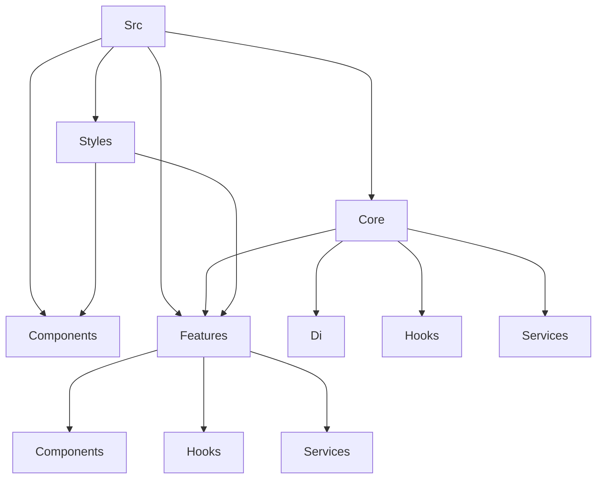

# React Architecture

This is a simple React project to demostrate how libraries like Mobx and Inversify works with the purpose of creating a scalable and maintainable architecture.

## Table of Contents

- [Getting startet](#getting-startet)
  - [Run Development Server](#run-development-server)
- [Preview](#preview)
- [Build for Production](#build-for-production)
- [Update Versions](#update-versions)
- [Run Tests](#run-tests)
- [Structure](#structure)
  - [Core](#core)
    - [Dependency Injection](#dependency-injection)
    - [Hooks](#hooks)
    - [Services](#services)
  - [Features](#features)
  - [Components](#components)
  - [Styles](#styles)
- [Dependencies](#dependencies)

## Getting startet

Intall the dependencies:

```bash
npm install
```

Create a `.env` file in the root of the project with the following content:

```env
VITE_API_URL=https://your-api-url.com
VITE_API_USER=your-api-user
VITE_API_PASSWORD=your-api-password
```

### Run Development Server

```bash
npm run dev
```

Open [http://localhost:3000](http://localhost:3000) to view it in the browser.

## Preview

```bash
npm run preview
```

## Build for Production

```bash
npm run build
```

# Update Versions

```bash
npm run version:patch
npm run version:minor
npm run version:major
```

# Run Tests

```bash
npm run test
nmp run test:watch
```

# Structure



The project is divided into the following folders:

- `Components`: Contains the shared components of the application.
- `Core`: Contains the core of the application, like the dependency injection container, hooks, services, etc.
- `Features`: Contains the features of the application, each feature has its own components, hooks, and services.
- `Styles`: Contains the global styles of the application.

## Core

Ideally `Core` must be independent of the `Features` and `Components` folders, so it can be eventually extracted to a separate package.

### Dependency Injection

The dependency injection container is created using InversifyJS, it is initialized in the `di` folder and exported as a singleton.

### Hooks

The hooks are created in the `hooks` folder, they are used to abstract the logic from the components.

### Services

The services are created in the `services` folder, they are used to abstract the logic from the components and hooks.

## Features

Each feature has its own components, hooks, and services, they are created in the `features` folder.
Each feature represents a smart component that is responsible for the business logic of the feature.

## Components

The shared components are created in the `components` folder, they are used by the features, must be isolated and reusable.

## Styles

The global styles are created in the `styles` folder, they are used by the features and components.

## Dependencies

- [React](https://reactjs.org/)
- [Mobx](https://mobx.js.org/README.html)
- [InversifyJS](https://inversify.io/)
- [Vite](https://vitejs.dev/)
- [Jest](https://jestjs.io/)
